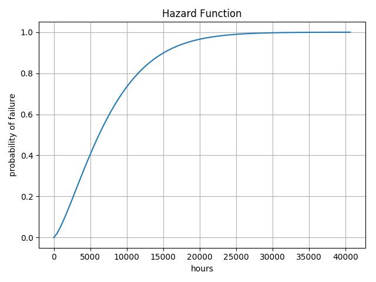

Analysis
========

The Analysis class is the primary class which will provide methods for analyzing your life data. This class is designed to take your data and calculate :math:`\beta` and :math:`\eta` values along with generating any appropriate plots for display of your data.

A typical use case of the ``Analysis`` case is as follows::

    import weibull

    # fail times include no censored data
    fail_times = [
        9402.7,
        6082.4,
        13367.2,
        10644.6,
        8632.0,
        3043.4,
        12860.2,
        1034.5,
        2550.9,
        3637.1
    ]

    # this is where the actual analysis and curve fitting occur
    analysis = weibull.Analysis(fail_times, unit='hour')

Fitting
-------

The ``fit()`` method is used to calculate appropriate :math:`\beta` and :math:`\eta` values, which are then stored into the class instance.  When ``fit()`` is called with no parameters, then the linear regression method of calculation is assumed::

    analysis.fit()

An alternative method is to use the Maximum Likelihood Estimation (MLE) method of fitting :math:`\beta` and :math:`\eta` to the data.  This may be done by specifying that the ``method='mle'``::

    analysis.fit(method='mle')

In many cases, the ``mle`` and ``lr`` methods will yield very similar values for :math:`\beta` and :math:`\eta`, but there are some cases in which one is preferred over the other.  It turns out that linear regression tends to work best for very low sample sizes, usually less than 15 while the maximum likelihood estimator works best for high sample sizes.  In both cases, the ``probplot()`` method should be used to verify that the data is a good fit.

To retrieve the :math:`\beta` and :math:`\eta` values, simply use the instance variables ``beta`` and ``eta``::

    print(f'beta: {analysis.beta: .02f}')
    print(f'eta: {analysis.eta: .02f}')

When using the ``fit()`` method, it is also possible to set the confidence levels

Use the ``stats()`` method to get a ``pandas.Series`` containing most internal estimates::

    $> analysis.stats
    fit method          maximum likelihood estimation
    confidence                                    0.6
    beta lower limit                          2.42828
    beta nominal                              2.97444
    beta upper limit                          3.64344
    eta lower limit                           186.483
    eta nominal                               203.295
    eta upper limit                           221.622
    mean life                                  181.47
    median life                               179.727
    b10 life                                   95.401
    dtype: object

Plotting
--------

One of the most often requested features of such a package is plotting the data, particularly in Jupyter Notebooks.  The ``weibull`` package comes with built-in methods to easily display and save standard plots with one-line methods.

Building on the ``analysis`` instance above, we will examine the probability plot::

    analysis.probplot()

.. image:: images/weibull-fit-10pt.png

We can also examine a number of other common function plots (only the hazard plot is shown, but the others are along the same line).::

    analysis.pdf()
    analysis.sf()
    analysis.hazard()
    analysis.cdf()

Each of these functions will generate a plot that is suitable for publication or insertion into a Jupyter Notebook.  Again, note that some of these methods - such as ``hazard()`` and ``cdf()`` will produce the same plot with slightly different labeling.

Class Documentation
-------------------

.. autoclass:: weibull.Analysis
    :members:
