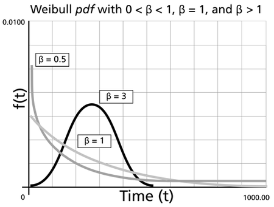
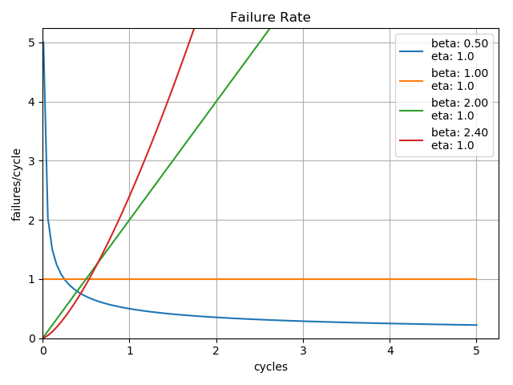
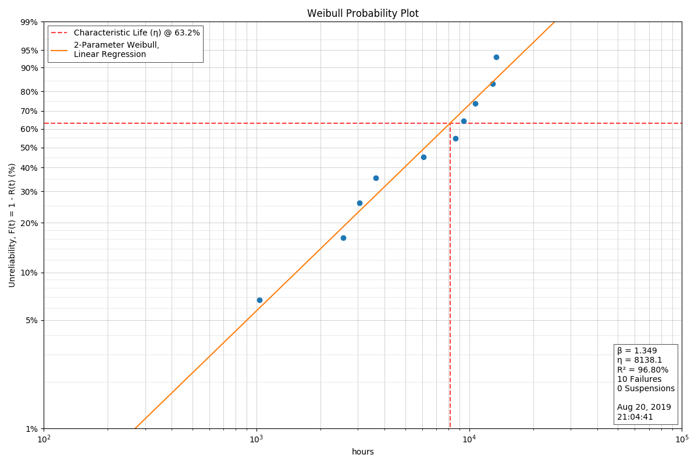

.. _introduction-to-reliability-analysis:

Introduction to Reliability Analysis
====================================

Weibull Distribution
--------------------

In reliability analysis and, thus, in the ``weibull`` package, we are primarily concerned with the 2-parameter Weibull probability density function defined herein as:

.. math::
  F(x) = \frac{\beta}{\eta} \left(\frac{x}{\eta}\right)^{\beta-1} e^{-\left(x/\eta\right)^\beta}

where:

 - :math:`\beta` or *beta* represents the **shape** parameter
 - :math:`\eta` or *eta* represents the **scale** parameter
 - :math:`x` represents the value at which the function is to be evaluated

Were one to plot the above :math:`F(x)` with given :math:`\beta` and :math:`\eta` values, one would get the probability density function, commonly shortened to PDF.  From the PDF alone, it is possible to derive the cumulative distribution function (a.k.a CDF and hazard functions), along wih the survival function which is very useful in reliability engineering.

Distribution Shape
******************

The **shape** parameter, :math:`\beta`, determines the overall shape of the distribution.  There are three primary regions in which :math:`\beta` may fall:

 - :math:`\beta < 1.0` Indicates infant mortality, or decreasing failures as time increases.  This is a distribution that may be observed when a phenomenon such as adhesive curing exists. As the adhesive cures, the product experiences fewer failures.
 - :math:`\beta = 1.0` Indicates 'random' or 'constant' failures.  This sort of distribution is most commonly applied to some electronic component categories, such as semiconductors.
 - :math:`\beta > 1.0` Indicates a wearout style of distribution.  This distribution is commonly observed on elements such as bearings which will increase their failure rate as wear increases.

It is possible for a product to exhibit all three of these characteristics on different components.  Imagine a car which has adhesives, electronics, and bearings, each of which have their own failure distributions.  With careful analysis of the failure modes, it is possible to determine the individual component failure distributions, which allows the designer to potentially identify and resolve the most problematic elements of the design first.

It is the combination of these three potentially different :math:`\beta` characteristics that gives rise to the traditional bathtub curve commonly observed in reliability analysis.  Looking closely at the plot of failure rates, one can see that a product composed of three different :math:`\beta` characteristic components could begin to form an overall bathtub curve of the composite failure rates.

.. image:: images/bathtub-components.png

Distribution Scale
******************

The **scale** parameter, :math:`\eta`, determines the scale of the distribution.  This parameter is also known as the *characteristic life* of the product and corresponds to the cycles at which 63% of the product has failed.

.. image:: images/eta-effects-on-pdf.png

Note that changes in the scale factor keep the shape, but effectively change the length over which the distribution is 'stretched'.  The change in height is due to the property that the area under the curve must always be equal to 1.0.

Censoring Data
--------------

For the reliability engineer, there are three possible scenarios for a batch of units:

 1. All units are running with no failures
 2. Some units have failed, but not all OR test was stopped before all units failed (right-censored)
 3. All units have failed (not censored, or 'complete' data)

The Weibull distribution can handle scenarios 2 and 3 well, but failures are inherently part of the equation.  If there are no failures, the best that can be expected is a lower estimate for the life.

Determining :math:`\beta` and :math:`\eta`
------------------------------------------

The first task of the reliability engineer is to determine suitable values for :math:`\beta` and :math:`\eta`.  The two most common options are:

 - plot the points on Weibull paper, approximate a line, determine the slope and characteristic life
 - maximum likelihood estimate (MLE)

In general, if only a small number of data points are available, then the approximation using Weibull paper or its equivalent will generate good results.  If there is a relatively large body of data available, then MLE methods are preferred.  Both methods will generally give acceptable results, assuming that the Weibull distribution adequately describes the process.

Currently, this package uses the linear regression (LR) and maximum likelihood estimation (MLE) techniques for estimating :math:`\beta` and :math:`\eta`.  Generally, MLE is preferred for larger data sets while LR is preferred for smaller data sets (less than 15).  Examination of the fit is still essential in both methods to determine if the model actually fits the data appropriately.

.. _b-life:

B-Life
------

A common and effective method for specifying the life of a product is to specify the time when a certain portion of the units are expected to experience failure.  This is often called the B-life of a product where B is followed by the number which specifies the percent of units failed.  For instance, if one were to say that the B10 life of a product were 100 hours, then it would be expected that 10% of all units will have failed at 100 hours.

.. _confidence-levels:

Confidence Levels
-----------------

Now that you have some :math:`\beta` and :math:`\eta` values, what does that mean?  How certain are you that :math:`\beta` and :math:`\eta` are what you have calculated?  After all, there is almost certainly some level of variation in the data.  Enter ``confidence limits``.  In short, most confidence limits on statistical data will assume a normal distribution to the right or the left of the curve.  So, for instance, if you are looking at a probability plot, you assume that most of the points will be close to the line while some smaller number of points will be further from the line.  The distance from the line will fall in a normal distribution straddling the line.

This package integrates confidence limits on the calculation of :math:`\beta` and :math:`\eta` such that the confidence limits define the range of certainty for :math:`\beta` and :math:`\eta` independently.  For instance, if the confidence limit is 0.95, then our calculation is 95% certain that the true :math:`\beta` falls between :math:`\beta_{lower}` and :math:`\beta_{upper}`.  In addition, our calculation is 95% certain that the true :math:`\eta` falls between :math:`\eta_{lower}` and :math:`\eta_{upper}`.  The confidence limits are generally calculated when the curve is fitted.

The best way to increase the confidence limits is to gather more data.  As more data is gathered, then the distributions of :math:`\beta` and :math:`\eta` are better defined.
