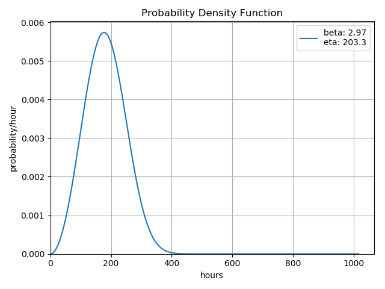
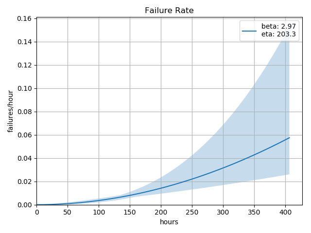

Gallery
========

Example 1: Multiple-Censored Data
---------------------------------

The code::

    import weibull

    fail_times = [
        42.1, 105.9, 151.3, 195.6,
        77.8, 117.0, 157.3, 207.0,
        83.3, 126.9, 163.8, 215.3,
        88.7, 138.7, 177.2, 217.4,
        101.8, 148.9, 194.3, 258.8
    ]

    suspensions = [1, 0, 1, 1,
                   0, 0, 0, 0,
                   1, 0, 0, 1,
                   1, 0, 1, 0,
                   0, 0, 1, 1]

    # this is where the actual analysis and curve fitting occur
    analysis = weibull.Analysis(fail_times, suspensions, unit='hour')
    analysis.fit(method='mle', confidence_level=0.6)

    print(analysis.stats)

    analysis.probplot(file_name='gallery-probplot.png')

    analysis.pdf(file_name='gallery-pdf.png')
    analysis.hazard(file_name='gallery-hazard.png')
    analysis.sf(file_name='gallery-survival.png')
    analysis.fr(file_name='gallery-fr.png')

.. image:: images/gallery-probplot.png

.. image:: images/gallery-hazard.png

.. image:: images/gallery-survival.png

