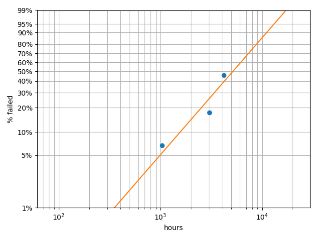
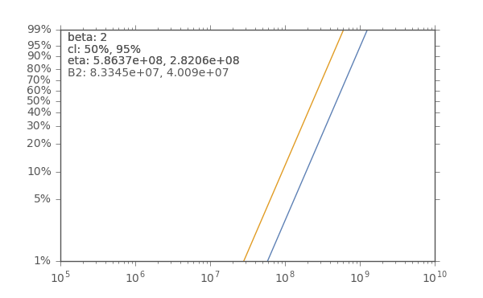

# Purpose

This package is intended to ease reliability analysis using the Weibull distribution, which is the most common method of reliability analysis.  Check out the [documentation](http://weibull.readthedocs.io/en/latest/index.html) for more information!

# Project Maturity

I am making every effort to ensure that every release is technically sound; however, it is possible that something is technically incorrect!  It is up to the user to verify functionality for themselves.

In addition, the interface is still maturing as I run it through different use cases and there will likely be breaking changes until the 1.0 release.  There will not be any breaking changes until major release numbers after that.

# Installation

Ideally, you should be able to `pip install weibull` and simply be finished.  This package is a pure-python package, so it should work on any os.  Unfortunately, this package utilizes other packages which may be more difficult to install.  Please consult package documentation for more details.

This user had the most issues installing `statsmodels` in a Windows 10 environment.  Other package dependencies - `numpy`, `pandas`, and `matplotlib` - installed without issue.

If you are having installation issues, perhaps try the [Anaconda](https://www.anaconda.com/download/) distribution!  As I understand it, they have solved most of these installation problems for difficult packages!

# Weibull Reliability Overview

The three primary classes are the `Analysis`, `Design`, and `Weibayes`.  Most users will want to use the `Analysis` and `Design` classes.

 - `Analysis` - use this when you have real-world or simulated data to determine the beta and eta values
 - `Design` - use this to determine the test time and number of units to run
 - `Weibayes` - basic weibayes methods implemented

## Weibull Analysis

The most fundamental weibull analysis is to calculate the values of beta and eta for a given list of life data.  The curve fit can deal with censored as well as uncensored data.  

### Considerations

The basic method used within the `Analysis` class is the electronic equivalent of curve fitting on weibull paper.  In short, it uses regressions to determine the beta and eta values.  This works quite well for small sample sizes, but other methods - such as maximum likelihood - may yield more accurate results as sample size increases.

### Fitting

A basic example is shown here, but more complete examples may be found within the [examples](examples/) directory.  Note that the `fail_times` starts as an array of `None`, indicating units that have not failed (right-censored data).  This will yield a conservative estimate as the currently accumulating run time will not be taken into account.

    import weibull
    
    # Take real data and supply it for the failure times,
    # leaving right-censored data as None for conservative
    # valus or supply a current run time and a censored 
    # array for better estimates.
    fail_times = [None] * 10
    fail_times[7] = 1034.5
    fail_times[8] = 2550.9
    fail_times[6] = 3043.4
    
    analysis = weibull.Analysis(fail_times, unit='hour')
    analysis.fit()
    
    analysis.probplot()
    
    print(f'beta: {analysis.beta}\teta: {analysis.eta}')

For a more accurate beta value, specify fail times and run the analysis with a separate `suspended` column.  This takes into account the accumulated run time since the last failure and will generally improve beta values and overall cycles:

    current_run_time = 4200.0
    
    fail_times = [current_run_time] * 10
    fail_times[7] = 1034.5
    fail_times[8] = 2550.9
    fail_times[6] = 3043.4
    
    suspended = [True, True, True, True, True,
                 False, False, False, True, True]
    
    analysis = weibull.Analysis(fail_times, suspended=suspended, unit='hour')
    analysis.fit()
    
    print(f'beta: {analysis.beta}\teta: {analysis.eta}')
    analysis.probplot()
    

The `probplot` should give you a good visual indication of the fit, but a more quantitative analysis can be obtained by calling the `fit_test` property:

    analysis.fit_test
    
                                OLS Regression Results                            
    ==============================================================================
    Dep. Variable:                      y   R-squared:                       0.958
    Model:                            OLS   Adj. R-squared:                  0.916
    Method:                 Least Squares   F-statistic:                     22.82
    Date:                Thu, 14 Dec 2017   Prob (F-statistic):              0.131
    Time:                        10:31:56   Log-Likelihood:                 2.7472
    No. Observations:                   3   AIC:                            -1.494
    Df Residuals:                       1   BIC:                            -3.297
    Df Model:                           1                                         
    Covariance Type:            nonrobust                                         
    ==============================================================================
                     coef    std err          t      P>|t|      [0.025      0.975]
    ------------------------------------------------------------------------------
    const          9.0268      0.314     28.786      0.022       5.042      13.011
    x1             0.7647      0.160      4.777      0.131      -1.269       2.799
    ==============================================================================
    Omnibus:                          nan   Durbin-Watson:                   2.947
    Prob(Omnibus):                    nan   Jarque-Bera (JB):                0.475
    Skew:                           0.623   Prob(JB):                        0.788
    Kurtosis:                       1.500   Cond. No.                         7.87
    ==============================================================================
    
    Warnings:
    [1] Standard Errors assume that the covariance matrix of the errors is correctly specified.
    
### Distribution Plotting 

In addition, it is also possible to plot each of the following distributions:

 - `analysis.pdf(show=True, file_name=None)` - probability density function
 - `analysis.sf(show=True, file_name=None)` - survival function
 - `analysis.hazard(show=True, file_name=None)` - hazard function
 - `analysis.cdf(show=True, file_name=None)` - cumulative density function (hazard function)
 - `analysis.fr(show=True, file_name=None)` - failure rate
 
### Summary Data

Some summary data may be accessed using properties:

 - `analysis.mttf` - mean time to failure (MTTF)
 - `analysis.mean` - mean (corresponds to MTTF)
 - `analysis.median` - the median life
 - `analysis.characteristic_life` - the characteristic life (corresponds to eta)
 
### B Life

A B-life is the operating time until a percentage of the units have failed.  For instance, a B10 life is the life of a product until 10% of the units have failed.  To calculate the "B life", you may use the `b()` method with a parameter being the b life number:

    $> analysis.b(2)
    451.37
    $> analysis.b(10)
    1535.17

## Test design

The `Design` class is to be utilized for two scenarios:

 - determine the required number of units to prove the target reliability given a test cycles/duration
 - determine the required number of cycles/duration to prove the target reliability given a number of units
 
To begin, first import and instantiate the `Designer`, which is the utility for the test designer.  There are several parameters to consider and all of them are requirements or assumptions that must be entered as parameters for the `Designer` class:

 - `target_cycles` - the target to be proven in hours/days/weeks/cycles
 - `reliability` - defaults to 0.9
 - `confidence_level` - defaults to 0.95
 - `expected_beta` - an initial assumption for beta (defaults to 2)

Shown are two example calculations for a target lifetime of 10000 hours with a reliability of 0.9 at a confidence level of 0.5 and beta assumption of 1.5:

    import weibull
    
    designer = weibull.Design(
        target_cycles=10000,
        reliability=0.9,
        confidence_level=0.90,
        expected_beta=1.5
    )
    
    # The 'test_cycles' parameter can be in any units.
    # Days, weeks, hours, cycles, etc., so long
    #   as the target unit is consistent
    print(f'Minimum number of units for 10000 hour run: {designer.num_of_units(test_cycles=10000)}')
    print(f'Minimum hours for 20 units: {designer.num_of_cycles(num_of_units=20)}')

## Weibayes

Use Weibayes analysis to assist with designing your test or evaluating reliability within a certain confidence interval based on historical data.

You have a product that needs to be tested to B2 life of 40 million time units with a confidence limit of 95%.  The product had an expected beta of 2 (lots of historical data there).  B2 life is the same as 98% survival. 

Using the weibull test `Design` class, we need to run 62 units (the limit of our test rig) for 62 million time units with no failures:

    import weibull
    
    designer = weibull.Design(
        target_cycles=40e6,
        reliability=0.98,
        confidence_level=0.95,
        expected_beta=2
    )
    
    print(f'Minimum hours for 62 units: {designer.num_of_cycles(num_of_units=62)}')
    
Result:

    61860134.45191945

Weibayes analysis on the data would arrive at the same result.

    import weibull
    
    # we want N units to run for H hours each
    N = 62
    H = 62.0e6
    
    run_times_desired = [H] * N
    weibayes = weibull.Weibayes(run_times_desired, confidence_level=0.95, beta=2)
    
    print(f'B2 life: {weibayes.b(2)}')
    
Results:

    B2 life: 40090439.86038491
    
Note that this `B2` matches very closely with `target_cycles` value found in the above iteration of the `Design` class.

We can further plot the data using `weibayes.plot()` resulting in:

# Contributions

Initial work on this repository was done by user [tgray](https://github.com/tgray).  You can still peruse the [original repository](https://github.com/tgray/weibull).

It would be highly useful to have different estimation methods and confidence bounds within the `Analysis` class.  If you are feeling froggy, please, submit your pull request!
