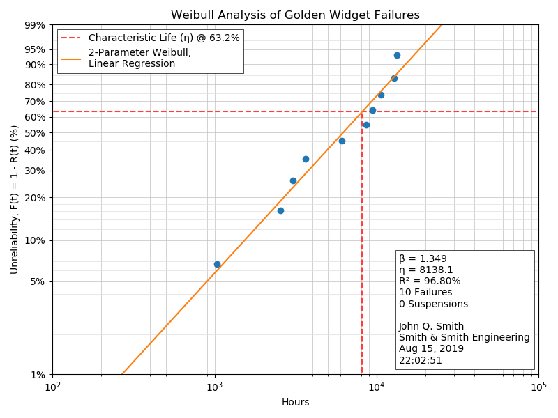
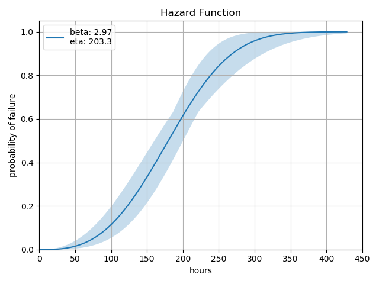
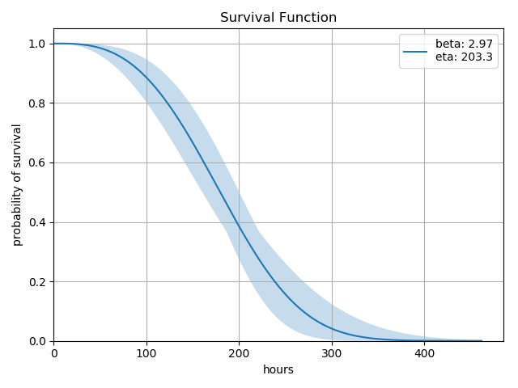

# Purpose

This package is intended to ease reliability analysis using the Weibull distribution, which is the most common method of reliability analysis.  Check out the [documentation](http://weibull.readthedocs.io/en/latest) for more information!

```diff
- This project has been superceded by a better 
- library called reliability.  Please head over there and 
- show the author some love!
```

[reliability](https://reliability.readthedocs.io/en/latest/)

# Project Maturity

The functionality implemented herein is accurate to the best of my ability, but you should head on over to [reliability](https://reliability.readthedocs.io/en/latest/) for a more feature-rich and better-maintained project.

```diff
- This project will not have future revision and 
- you should refactor your code accordingly.  I 
- have included an import warning in `v0.1.3`.
```

# Gallery

## Probability Plot



## Hazard Function



## Survival Function



# Contributions

As this library is being depreciated and superceded by the community, I will happily recommend that you direct your efforts towards the [reliability](https://reliability.readthedocs.io/en/latest/) project.  Thank you!

Initial work on this repository was done by user [tgray](https://github.com/tgray).  You can still peruse the [original repository](https://github.com/tgray/weibull).

Beautiful probably plots contributed by user [AlanLesmerises](https://github.com/AlanLesmerises).
